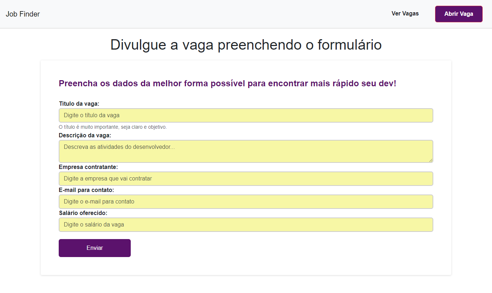

<h1 align="center"> Job Finder </h1>

Land Page criada para divulgação de vagas de empregos para desenvolvedores, e para as empresa adicionar vagas. 

  <a href="#-tecnologias">Tecnologias</a>     |    
  <a href="#-projeto">Projeto</a>     |    
  <a href="#memo-licença">Licença</a>

  

 

  
  
  

##  🚀 Tecnologias

Esse projeto foi desenvolvido com as seguintes tecnologias:

- HTML e CSS
- JavaScript
- Node.js
- Express (Framework)
- sqlite (banco de dados)
- Bootstrap (framework CSS)
- Postman (plataforma de API para desenvolvedores projetar, construir, testar e iterar suas APIs)
- Git e Github

##  💻 Projeto

O Job Finder é um site para ajudar a encontrar sua vaga dos sonhos.

## : memo : Licença 

Esse projeto está sob a licença MIT.

---

Feito com ♥ pela Desenvolvedora front-end Katia Souza